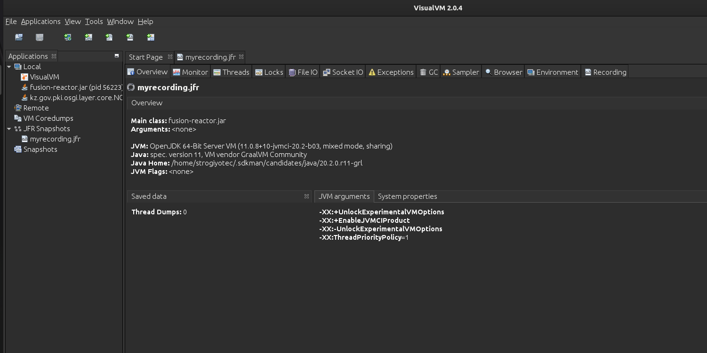

## Comparing jstack and jcmd with FusionReactor – see how much more you get

In one of our previous [blog](https://www.fusion-reactor.com/blog/java-visualvm-alternatives/) posts we tried to compare Java VisualVM with FusionReactor. Today we will try to compare features that jcmd and jstack provide with FusionReactor.


## jcmd and jstack Definition
### jstack
Let's start with jstack. According to Oracle's documentation
>The jstack command-line utility attaches to the specified process or core file and prints the stack traces of all threads that are attached to the virtual machine, including Java threads and VM internal threads, and optionally native stack frames. The utility also performs deadlock detection.
First, we need to mention that Java VisuaVM provides all the features available by jstack

To make it simple, `jstack` is a terminal based utility that prints the stacktraces of the given JVM process.
For example, in order to see stacktraces of the Java program with **PID** 1302 you need to run the following command in the terminal `jstack 1302`. 
Here is the sample output that you can get from a running Spring-Boot application with embedded Tomcat

```
"http-nio-8080-exec-1" #23 daemon prio=5 os_prio=0 cpu=0.24ms elapsed=12.29s tid=0x00007f153cb0a800 nid=0x156fd waiting on condition  [0x00007f14a60b1000]
   java.lang.Thread.State: WAITING (parking)
        at jdk.internal.misc.Unsafe.park(java.base@11.0.8/Native Method)
        - parking to wait for  <0x000000008e3e0e10> (a java.util.concurrent.locks.AbstractQueuedSynchronizer$ConditionObject)
        at java.util.concurrent.locks.LockSupport.park(java.base@11.0.8/LockSupport.java:194)
        at java.util.concurrent.locks.AbstractQueuedSynchronizer$ConditionObject.await(java.base@11.0.8/AbstractQueuedSynchronizer.java:2081)
        at java.util.concurrent.LinkedBlockingQueue.take(java.base@11.0.8/LinkedBlockingQueue.java:433)
        at org.apache.tomcat.util.threads.TaskQueue.take(TaskQueue.java:146)
        at org.apache.tomcat.util.threads.TaskQueue.take(TaskQueue.java:33)
        at org.apache.tomcat.util.threads.ThreadPoolExecutor.getTask(ThreadPoolExecutor.java:1114)
        at org.apache.tomcat.util.threads.ThreadPoolExecutor.runWorker(ThreadPoolExecutor.java:1176)
        at org.apache.tomcat.util.threads.ThreadPoolExecutor$Worker.run(ThreadPoolExecutor.java:659)
        at org.apache.tomcat.util.threads.TaskThread$WrappingRunnable.run(TaskThread.java:61)
        at java.lang.Thread.run(java.base@11.0.8/Thread.java:834)
```

As you can see, `jstack` shows us one of the **Tomcat's** thread which is waiting for new requests to come.

jstack is available as a part of the Oracle's JDK since JDK 6. However, we have to mention that since JDK 8 ,Oracle wants to depricate this utility. According to **jstack** [official documentation](https://docs.oracle.com/javase/8/docs/technotes/guides/troubleshoot/tooldescr016.html)
>The release of JDK 8 introduced Java Mission Control, Java Flight Recorder, and jcmd utility for diagnosing problems with JVM and Java applications. It is suggested to use the latest utility, jcmd instead
Which means that for java versions starting from 8 and higher the `jcmd should be used`
### jcmd
Now let's cover jcmd.
According to [official documentation](https://docs.oracle.com/javase/8/docs/technotes/guides/troubleshoot/tooldescr006.html)
> The jcmd utility is used to send diagnostic command requests to the JVM, where these requests are useful for controlling Java Flight Recordings, troubleshoot, and diagnose JVM and Java Applications.
`jcmd` is available as part of the JDK starting from version 8. It can do a lot more than `jstack` and is used as a general console based performance tracker tool for JVM. It is used in conjuction with events you are interested in. For example , in order to see the same stacktraces as we got with `jstack` above , the following command must be used `jcmd fusion-reactor.jar Thread.print`. 
From now on , we will compare `jcmd` with FusionReactor because all `jstack` features are already available in `jcmd`


## Comparison

### Side note
Before comparing both tools, we want to emhpasize that `jcmd` can only take statistics snapshots of the running JVM process which were available on the time of execution. On the other hand FusionReactor is a complete monitoring tool that supports a huge range of monitoring opions including Garbage collector , Heap allocations, JDBC , Web performance, Live debugging and a lot more. To be fair, we will only compare features that are available in both tools.

### Console vs Web
The first big difference comes with the way both tools are launched. FusionReactor offers a web interface to monitor your JVM processes. The interface can be launched locally or through the Cloud in order to monitor remote processes in production environment. On the other hand `jcmd` can only be used within a terminal. Most people who get used to a great user experience offered by web or desktop apps won't feel comfortable opening the terminal to monitor the performance of the underlying application. Moreover, `jcmd` can only get snapshots of the JVM processes that runs on the same host which means that `jcmd` does not support remote processes. In order to use `jcmd` in production the developer will have to have an **ssh** access to the remote machine first while with FusionReactor it's a matter of opening your browser.

### Threads
As was shown above, `jcmd` can print the stacktraces of all threads running in the JVM with the following command `jcmd <process id/main class> Thread.print`. For regular Servlet based backends with few hunderds threads serving user requests the output will be unreadable. Developer must rely on other utilities such as `grep` or `awk` in order to get the stacktraces of the Servlet Thread they are interested in.

On the other hand, **FusionReactor** offers a separate page that covers all Thread related information.

The interface offers a list of available threads with corresponding states (E.g RUNNABLE or WAITING). Moreover, **FusionReactor** doesn't show the stacktraces as a plain text, all stacktraces are shown in prettified format that helps developers to better understand what the thread is actually doing

Apart from that, the dynamic nature of **FusionReactor** allows you to stop or pause the running thread.

### Heaps
Heap is one of the main place to look at when you have a production level JVM problems such as long GC pauses or unreasably big memory usage.
`jcmd` supports heap statistics through the heapdumps.
>A heap dump is a snapshot of all the objects in the Java Virtual Machine (JVM) heap at a certain point in time
To get a heapdump of the running process you can use the following command `jcmd <pid> GC.heap_dump filename=Myheapdump` which will create a heap snapshot in the file named **Myheapdump**. After that you will have to use a separate software that can read heapdumps, the official one recommended by Oracle is **Java VisualVM**. These two steps are really cumbersome and take a lot of time. Moreover `jcmd` can only show heap insides on the time of the execution, previous heap statistics are not available.

With **FusionReactor** you have a web page that shows all memory spaces with corresponding graphs

You don't have to create heapdumps, **FusionReactor** will do it for you. Moreover, all memory metrics are recorded and persisted for future viewing.

### Troubleshooting
Java 8 introduced a new monitoring tool called Java Flight Recorder which collects events from the running JVM process.  Let's say you want to understand why calling a specific REST endpoint eats up a lot of CPU time. In this case `jcmd` can record events from the process and save them into the file. Here is the command to use `jcmd <pid> JFR.start name=MyRecording settings=profile duration=20s filename=myrecording.jfr`. You can run this command which will collect events for 20 seconds, then call the endpoint and then he `jfr` file will have all the events for this period of time. You will however need another tool to work with `jfr` files. The default one that comes wih a JDK is a Java VisualVM

In the screen above you can see that JFR makes a great job gathering a lot of metrics about the Java process (Threads, Exceptions, GC, Locks etc). One big drawback here is that as with the heap , `jcmd` itself can only create a file which then has to be opened by different program. Another problem is that you must run flight recorder to get the data from JVM, if problem occured without a running flight recorder you won't be able to understand what went wrong.

With FusionReactor, the applcation is constantly monitored, you don't have to create `jfr` files and analyze them. If you got a CPU related issue, FusionReactor will show you the thread that took up the most CPU time along with corresponding Stracktraces and information on each stack and how much time it took 


### Shell scripting
As `jcmd` is a command line utility it can be used as part of a shell script. Developer might want to write a script that periodically runs `jcmd` to create heapdumps or make a `jfr` snapshots. Along with flexibility to use a shell ecosystem it also brings a burden for development team to support these scripts and in most cases to integrate them with Cloud providers. With FusionReactor all the monitoring use cases are already implemented and those cases which are not covered can easily be integrated into FusionReactor with an awesome plugin system. Most importantly, FusionReactor supports integration with most popular cloud providers(such as AWS)


## FusionReactor right for you?
`jcmd` is a great tool for simple Java profiling that only covers current state of the JVM. If you need a whole monitoring system which supports all the featured offered by `jcmd` and more(Web performance, Live Debugging, System Monitoring) then consider using FusionReactor.

## TODO
1. jcmd only locally
2. ssh access
3. live recording
